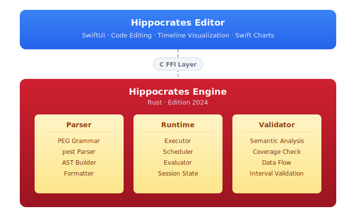

<p align="center">
  
</p>

<h1 align="center">Hippocrates</h1>

<p align="center">
  <em>A domain-specific language for medical care plans.<br>
  Readable by doctors. Executable by machines. Safe by design.</em>
</p>

---

> **⚠️ Experimental Software — Not for Clinical Use**
>
> Hippocrates is a research prototype and proof of concept. It has **not** been validated for clinical use, is **not** a certified medical device, and must **not** be used to make real medical decisions. If you need medical advice, talk to an actual doctor — preferably one who warns you about pork knuckles.

---

## The Story: How a Pork Knuckle Changed Healthcare

It was 2014, somewhere in Germany, and I was doing what any reasonable person would do on a fine evening: enjoying a proper *Schweinshaxe* -- a roasted pork knuckle with crispy skin, served with potato dumplings and a dark beer. Delicious. Crunchy. Maybe *too* crunchy.

**CRACK.**

A molar didn't survive the encounter. What followed was not just a dentist visit, but a months-long odyssey: tooth extraction, weeks of healing, an implant procedure, antibiotics (take one hour before surgery, then twice daily for nine days, no dairy products for two days...), follow-up controls, and finally the crown. Every step came with verbal instructions, sticky notes, and a prayer that I'd remember it all correctly.

Sitting in the dentist's chair, a thought formed: *What if all of these instructions -- the timing, the medications, the reminders, the decisions -- could be written as a script? Something a doctor could read and understand, but a phone could execute?*

That thought became **Hippocrates**.

### 12 Years of Specification, 27 Hours of Code

Over 2014 and 2015, I wrote the language specification. Eight versions. I designed the grammar, the philosophy (completeness, readability, safety), the architecture. I even built a pitch deck and showed it around. The vision was clear:

```ruby
<medication reminder> is a plan:
    every 12 hours:
        information to <patient> "Please take your dose now":
            message expires after 30 minutes.
```

But building a parser, a runtime, a validator, and an editor for a new programming language is... a lot. For one person with a day job, it was too much. The specification sat in a drawer. For **twelve years**.

Then, in January 2026, everything changed. AI had matured to the point where it could be a genuine coding partner. On **January 17, 2026**, I made the first commit. With Claude as my co-pilot, the Rust engine was parsing scripts within hours. A SwiftUI editor followed the next day. What had been impossible for a solo developer for over a decade became reality in roughly **27 hours**.

The project now has 21,000+ lines of code, a formal PEG grammar, a full runtime with scheduling and validation, a native macOS editor with timeline visualization, and V-Model specification documents with traceability matrices. All born from a broken tooth and a stubborn idea that refused to die.

## What is Hippocrates?

Hippocrates is a **domain-specific language (DSL)** and runtime for authoring and executing medical care plans. It's designed so that healthcare professionals can write treatment logic in near-natural language, while the engine guarantees safety through strict validation.

The core idea: **separate the medical domain from the technical domain**. A physician writes the *what*, the engine handles the *how*.

```ruby
<inhaler used> is an enumeration:
    valid values:
        <Yes>; <No>.
    question:
        ask "Did you use your inhaler today?":
            validate answer once.
            question expires after 1 hour.
            style of question is <Yes/No>.
```

## Why Hippocrates in the Age of AI?

You might ask: *if AI can already answer medical questions, why do we need a programming language for care plans?*

Because **AI hallucinates. Care plans must not.**

Large language models are extraordinary at understanding medical literature, reasoning about symptoms, and generating treatment suggestions. But they are probabilistic -- they can be confidently wrong, they drift between runs, and they cannot guarantee that every edge case in a dosing schedule is covered. For a medication reminder that fires at 3 AM, "probably correct" is not good enough.

Hippocrates solves this by splitting the problem in two:

1. **AI generates the plan.** An LLM can translate a physician's intent, a clinical guideline, or even a conversation into Hippocrates code. The language is close enough to natural language that this works remarkably well.

2. **The engine validates and executes it deterministically.** The Hippocrates runtime catches what AI misses: incomplete value ranges, missing units, overlapping assessment cases, undefined references. It provides structured feedback that the AI can use to fix its own output. Once a plan passes validation, it runs with the predictability of a state machine -- not a neural network.

This creates a **human-in-the-loop workflow** where AI accelerates authoring, the engine enforces safety, and the physician retains final authority:

```
  Physician Intent ──→ AI generates Hippocrates code
                              │
                              ▼
                     Engine validates plan
                        ╱           ╲
                   ✗ errors        ✓ valid
                      │               │
                      ▼               ▼
              AI fixes code     Plan runs deterministically
              (with engine      on patient's device
               feedback)
```

The language is intentionally constrained. You cannot write arbitrary logic, make network calls, or access the filesystem. The entire runtime is a sandbox. This is not a limitation -- it is the safety model. Every plan that passes the validator is guaranteed to be complete, unit-consistent, and free of dead branches.

In short: **AI is the author. Hippocrates is the safety net.**

## Key Features

- **Natural Language Syntax** -- Reads like English. Variables can be full phrases like `<severity of breathlessness>`. No programming background required.
- **Strict Unit Validation** -- All numeric values require explicit units (`10 mg`, `5 steps`). The engine rejects bare numbers.
- **Completeness by Design** -- Assessments must handle all possible value ranges. No silent gaps in medical decision logic.
- **Event-Driven Execution** -- Plans react to time windows, value changes, and external triggers. Scheduling is built into the language.
- **No Comparison Operators** -- Instead of `<`, `>`, `<=`, `>=`, Hippocrates uses ranges (`0 ... 10`). This eliminates off-by-one errors and forces explicit boundary thinking.
- **Double-Entry Validation** -- Built-in syntax for verifying critical data entry.
- **Localization Support** -- Scripts can be automatically translated to supported languages.
- **Platform Agnostic** -- The engine is a Rust library with a C FFI, embeddable in any host application.

## Language Concepts

### Definitions

Everything in Hippocrates is a **definition**. A care plan is built from these building blocks:

```ruby
<body temperature> is a number:           (* a numeric value with units *)
<inhaler used> is an enumeration:          (* a value with named options *)
<patient name> is a string:                (* free text *)
<best inhalation period> is a period:      (* a recurring time window *)
<COPD telehealth> is a plan:               (* the care plan itself *)
<Amoxicillin> is a drug:                   (* a medication with safety limits *)
<patient> is an addressee:                 (* someone who receives messages *)
<point> is a unit:                         (* a custom unit of measurement *)
```

### Natural-Language Identifiers

Variables use angle brackets and can be full phrases -- no abbreviations needed:

```ruby
<severity of breathlessness>
<inhaler used in past 5 days on time>
<use of rescue medication>
```

### Mandatory Units

All numeric values **must** carry units. Bare numbers are rejected by the engine:

```ruby
<body weight> is a number:
    valid values:
        0 kg ... 300 kg.

(* Built-in units: kg, mg, °C, °F, mmHg, bpm, ml, cm, ...  *)
(* Custom units:                                              *)
<dose> is a unit:
    plural is <doses>.
```

### Ranges Instead of Comparisons

There are no `<`, `>`, `<=`, `>=` operators. Instead, Hippocrates uses **ranges** with `...` -- this eliminates off-by-one errors and forces explicit boundary thinking:

```ruby
assess <body temperature>:
    35.0 °C ... 37.4 °C:
        information to <patient> "Your temperature is normal.".
    37.5 °C ... 38.4 °C:
        warning to <patient> "You have a mild fever.".
    38.5 °C ... 42.0 °C:
        urgent warning to <physician> "High fever detected.".
```

The engine validates that all ranges are **complete** -- every possible value must be covered. Gaps cause validation errors. This is a core safety feature.

### Values with Meanings

Numeric values can carry semantic meanings mapped to ranges:

```ruby
<severity of breathlessness> is a number:
    valid values:
        0 <points> ... 5 <points>.
    meaning of <severity of breathlessness>:
        valid meanings:
            <None>; <Not at all>; <Mild>; <Moderate>; <Severe>; <Worst possible>.
        0 <points>:
            meaning of value = <None>.
        1 <point>:
            meaning of value = <Not at all>.
        2 <points>:
            meaning of value = <Mild>.
```

### Questions and Data Collection

Values can define how they are collected from the patient:

```ruby
<inhaler used> is an enumeration:
    valid values:
        <Yes>; <No>.
    question:
        ask "Did you use your inhaler today?":
            validate answer once.
            question expires after 1 hour.
            style of question is <Yes/No>.
```

Question styles include Yes/No, Likert scales, visual analogue scales (VAS), and free text.

### Event-Driven Plans

Plans react to events -- time windows, value changes, and recurring triggers:

```ruby
<COPD telehealth> is a plan:
    during plan:                                         (* runs once at plan start *)
        <log> = "Plan started".

    <inhalation> with begin of <best inhalation period>: (* triggered by time window *)
        information to <patient> "Time for your inhaler.":
            message expires after <best inhalation period>.
        ask for <inhaler used>.

    every 1 hour:                                        (* recurring *)
        ask for <use of rescue medication>.

    change of <body temperature>:                        (* triggered by value change *)
        assess <body temperature>:
            37.5 °C ... 42.0 °C:
                urgent warning to <physician> "Fever detected.".
```

### Periods (Time Windows)

Periods define recurring time windows with weekday and time ranges:

```ruby
<best inhalation period> is a period:
    timeframe:
        between Monday ... Friday; 07:40 ... 07:50.
        between Saturday ... Sunday; 09:00 ... 09:10.
```

### Messages with Severity

Three severity levels, each targetable to specific addressees:

```ruby
information to <patient> "Remember to stay hydrated.".
warning to <patient> "Your readings are outside the normal range.".
urgent warning to <physician> "Immediate attention required.".
```

### Comments

```ruby
(* This is a comment. *)
(* Comments can span
   multiple lines. *)
```

## Architecture

<p align="center">
  
</p>

- **Engine**: Rust (edition 2024), using `pest` for PEG parsing, `serde` for serialization, `chrono` for timezone-aware time handling
- **Editor**: Native macOS app in SwiftUI with Swift Charts for timeline visualization
- **Integration**: C FFI layer for embedding in any platform (iOS, Android, web, server)

## Getting Started

### Prerequisites

- [Rust](https://rustup.rs/) (latest stable)
- Xcode (for the macOS editor, optional)

### Build the Engine

```bash
cd hippocrates_engine
cargo build --release
```

### Run an Example

```bash
cd hippocrates_engine
cargo run -- examples/treating_copd.hipp
```

### Build the macOS Editor

```bash
./build_engine.sh
open hippocrates_editor/HippocratesEditor.xcodeproj
```

## Example: COPD Telehealth Plan

A real-world example showing inhaler adherence tracking with trend analysis:

```ruby
<COPD telehealth> is a plan:
    during plan:
        <log> = "Plan started".

    <inhalation> with begin of <best inhalation period>:
        information to <patient> "It's the best time of the day to take your daily shot now":
            message expires after <best inhalation period>.
        ask for <inhaler used>.

    <reporting> with begin of <fill in evening report>:
        ask for <severity of breathlessness>.
        ask for <use of rescue medication>.

        assess <inhaler used in past 5 days on time>:
            Not enough data:
                information to <patient> "We are still collecting data for compliance check.".
            4 <doses>; 5 <doses>:
                information to <patient> "You are doing a great job in using the inhaler right on time".
            0 <doses> ... 3 <doses>; 6 <doses> ... 1000 <doses>:
                assess <inhaler used in past 5 days>:
                    0 <doses>:
                        information to <patient> "Not using a medication does not lead to improvement!".
                    1 <dose> ... 2 <doses>:
                        information to <patient> "You must use the inhaler more regular".
```

See [`hippocrates_engine/examples/`](hippocrates_engine/examples/) for more.

## Documentation

- [V-Model Specifications](hippocrates_engine/specs/) -- Requirements, design, traceability
- [Language Reference (Version 8)](documents/) -- Original design documents from 2014-2015

## Contributing

Hippocrates is open source and contributions are welcome. Whether you're a healthcare professional with domain knowledge, a Rust developer, or someone passionate about improving patient care -- there's a place for you here.

## License

This project is licensed under the **GNU General Public License v3.0** -- see the [LICENSE](LICENSE) file for details.

---

<p align="center">
  <em>Born from a Schweinshaxe. Built with AI. Made for patients.</em>
</p>
