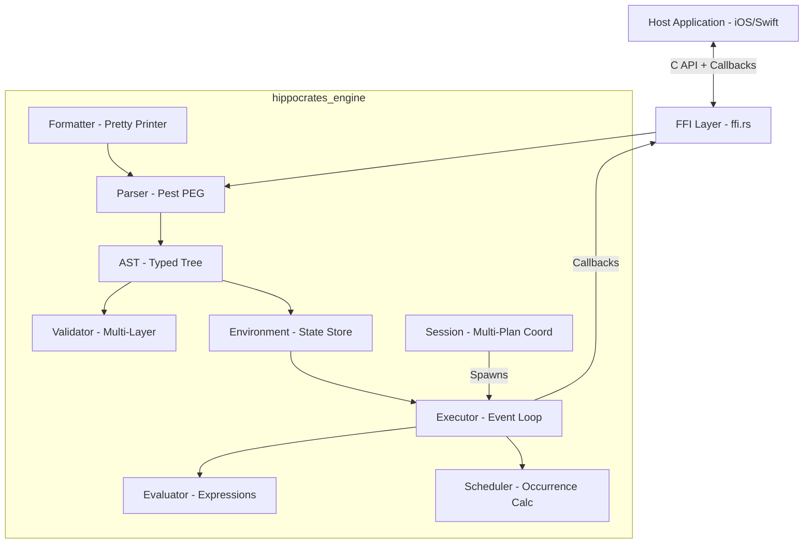

# System Design (DES)

**Document ID:** DES
**Version:** 1.0
**Status:** Draft

This document describes the as-built system design of the Hippocrates engine. It reflects the actual implementation, which diverges from the original `runtime_architecture.md` planning document in several significant ways (see Section 7).

---

## 1. Design Overview

### SYS-HIPP-001 — Language Selection: Rust

**Traces to:** SREQ-HIPP-003

The engine is implemented in Rust (Edition 2024). Rust was selected for:
- **Memory safety** without garbage collection, critical for a medical runtime.
- **C-FFI compatibility** via `extern "C"` functions, enabling embedding in iOS (Swift) and other platforms.
- **No runtime overhead** — no VM, no GC pauses, deterministic execution.

### SYS-HIPP-002 — Dual Crate Output

**Traces to:** SREQ-HIPP-003

The crate produces two library types (configured in `Cargo.toml`):
- `rlib` — standard Rust library for use by other Rust crates and tests.
- `staticlib` — C-compatible static library (`libhippocrates_engine.a`) for linking into host applications.

### SYS-HIPP-003 — C-FFI Boundary

**Traces to:** SREQ-HIPP-003

All platform integration occurs through a C-compatible FFI layer (`ffi.rs`). The engine exposes opaque pointer handles, callback registration, and JSON-serialized data exchange. Host applications never access Rust internals directly.

### Design Approach

The original `runtime_architecture.md` described a **bytecode compiler + virtual machine** architecture with **SQLite** for persistent state storage. The actual implementation uses:

- **AST-walking interpretation** — the parser produces an AST that the executor traverses directly. There is no bytecode compilation step and no virtual machine.
- **In-memory state** — all value history, definitions, and context are held in `HashMap`-based structures. There is no SQLite dependency and no on-disk persistence within the engine.

This simplification reduces complexity while preserving correctness. Persistence, if needed, is delegated to the host application via callbacks and the JSON-based value query API.

---

## 2. Component Architecture



### SYS-HIPP-010 — Parser

**Traces to:** REQ-HIPP-LANG-001, REQ-HIPP-LANG-002, REQ-HIPP-LANG-003, REQ-HIPP-LANG-004, REQ-HIPP-BASIC-001, REQ-HIPP-BASIC-002, REQ-HIPP-BASIC-003, REQ-HIPP-BASIC-004, REQ-HIPP-UNITS-001, REQ-HIPP-UNITS-002, REQ-HIPP-UNITS-003, REQ-HIPP-UNITS-004, REQ-HIPP-UNITS-005, REQ-HIPP-PROG-001, REQ-HIPP-STMT-001, REQ-HIPP-STMT-002, REQ-HIPP-STMT-003, REQ-HIPP-STMT-004, REQ-HIPP-STMT-005, REQ-HIPP-MED-001, REQ-HIPP-MED-002, REQ-HIPP-MED-003, REQ-HIPP-CORE-001, REQ-HIPP-CORE-002, REQ-HIPP-CORE-003, REQ-HIPP-CORE-005

The parser uses **Pest** (PEG parser generator). A `grammar.pest` file defines the Hippocrates language grammar. The parser module (`parser.rs`) transforms source text into the typed AST. Error messages include line and column numbers. An indentation preprocessor normalizes whitespace before parsing. The trigger grammar supports natural language sugar: bare unit names (`every day`) and ordinals (`every second day`, `every other week`) are desugared to numeric intervals at parse time (REQ-HIPP-EVT-007). Parse errors are mapped from internal PEG rule names to human-readable descriptions via a `rule_to_human()` function, ensuring raw grammar internals never appear in error messages (REQ-HIPP-CORE-005).

### SYS-HIPP-011 — AST Representation

**Traces to:** REQ-HIPP-BASIC-001, REQ-HIPP-BASIC-002, REQ-HIPP-BASIC-003, REQ-HIPP-BASIC-004, REQ-HIPP-UNITS-001, REQ-HIPP-UNITS-002, REQ-HIPP-UNITS-003, REQ-HIPP-UNITS-004, REQ-HIPP-UNITS-005, REQ-HIPP-PROG-001

The AST (`ast.rs`) is a typed tree of Rust structs and enums representing the full language: `Plan`, `Definition` (Value, Drug, Period, Unit, Addressee, Context, Plan), `Statement`, `Expression`, `Literal`, `Property`, `Action`, `Block`, `Trigger`, and `PlanBlock` variants. The AST is serializable via `serde` for JSON export through the FFI.

### SYS-HIPP-012 — Multi-Layer Validator

**Traces to:** REQ-HIPP-STMT-001, REQ-HIPP-STMT-002, REQ-HIPP-STMT-003, REQ-HIPP-STMT-004, REQ-HIPP-STMT-005, REQ-HIPP-MED-001, REQ-HIPP-MED-002, REQ-HIPP-MED-003, REQ-HIPP-CORE-001, REQ-HIPP-CORE-002, REQ-HIPP-CORE-003, REQ-HIPP-CORE-005, REQ-HIPP-REQP-001, REQ-HIPP-REQP-002, REQ-HIPP-REQP-003, REQ-HIPP-REQP-004, REQ-HIPP-REQP-005, REQ-HIPP-REQP-006, REQ-HIPP-REQP-007, REQ-HIPP-FLOW-001, REQ-HIPP-FLOW-002, REQ-HIPP-FLOW-003, REQ-HIPP-FLOW-004, REQ-HIPP-FLOW-005, REQ-HIPP-COVER-001, REQ-HIPP-COVER-002, REQ-HIPP-COVER-003, REQ-HIPP-COVER-004, REQ-HIPP-COVER-005, REQ-HIPP-COVER-006, REQ-HIPP-COVER-007, REQ-HIPP-COVER-008, REQ-HIPP-COVER-009, REQ-HIPP-COVER-010, REQ-HIPP-COVER-011, REQ-HIPP-COVER-012, REQ-HIPP-COVER-013, REQ-HIPP-COVER-014, REQ-HIPP-RANGE-001, REQ-HIPP-RANGE-002, REQ-HIPP-SUFF-001, REQ-HIPP-SUFF-002, REQ-HIPP-SUFF-003, REQ-HIPP-SUFF-004, REQ-HIPP-VALID-001, REQ-HIPP-VALID-002, REQ-HIPP-VALID-003

The validator (`runtime/validator/mod.rs`) performs static analysis on the parsed AST before execution. It is organized into four sub-modules:

- **`semantics`** — type checking, definition consistency, unit compatibility, and undefined reference detection (REQ-HIPP-VALID-002). References to undeclared variables, addressees, units, and periods produce errors naming the undefined identifier and listing available definitions of that type.
- **`intervals`** — numeric range analysis, gap/overlap detection in assessment cases.
- **`data_flow`** — use-before-assignment detection, dependency analysis.
- **`coverage`** — exhaustive case coverage verification for assessments and meaning models.

Validation produces a `Vec<EngineError>` with source locations. Each error may include a `suggestion` field with an actionable fix (REQ-HIPP-VALID-003): coverage gaps suggest the exact missing range, overlap errors suggest which range to adjust, and data flow errors suggest adding an `ask for` statement. The FFI exposes validation independently from execution (`hippocrates_validate_file`).

### SYS-HIPP-013 — Runtime Executor

**Traces to:** REQ-HIPP-PLAN-001, REQ-HIPP-PLAN-002, REQ-HIPP-ACT-001, REQ-HIPP-ACT-002, REQ-HIPP-ACT-003, REQ-HIPP-ACT-004, REQ-HIPP-ACT-005, REQ-HIPP-ACT-006, REQ-HIPP-ACT-007, REQ-HIPP-ACT-008, REQ-HIPP-ACT-009, REQ-HIPP-ACT-010, REQ-HIPP-EVT-001, REQ-HIPP-EVT-002, REQ-HIPP-EVT-003, REQ-HIPP-EVT-004, REQ-HIPP-EVT-005, REQ-HIPP-EVT-006, REQ-HIPP-EVT-007, REQ-HIPP-EXEC-001, REQ-HIPP-EXEC-002, REQ-HIPP-EXEC-003, REQ-HIPP-EXEC-004, REQ-HIPP-EXEC-005

The executor (`runtime/executor.rs`) is an event-driven engine built on a `BinaryHeap<ScheduledEvent>` (min-heap by time). It supports three event kinds:

- **`Periodic`** — recurring triggers with interval, iteration counter, optional max duration, and optional time-of-day pinning (REQ-HIPP-EVT-005, REQ-HIPP-EXEC-005).
- **`PeriodicByPeriod`** — pre-scheduled events for each occurrence of a named period within a duration window (REQ-HIPP-EVT-006). All occurrences are enumerated up front via the Scheduler.
- **`StartOf`** — period-triggered events scheduled via the Scheduler.

The event loop pops events in chronological order, advances environment time, drains pending inputs, executes statement blocks via AST-walking, and reschedules recurring events. A sliding 30-day window is used for period-based event scheduling. When a time-of-day is specified, both initial scheduling and rescheduling pin to the target time. After the event loop exits (all triggers exhausted or simulation time limit reached), the executor iterates plan blocks looking for `AfterPlan` blocks and executes their statements exactly once.

### SYS-HIPP-014 — Scheduler

**Traces to:** REQ-HIPP-PLAN-001, REQ-HIPP-PLAN-002, REQ-HIPP-EVT-001, REQ-HIPP-EVT-002, REQ-HIPP-EVT-003, REQ-HIPP-EVT-004, REQ-HIPP-EVT-005, REQ-HIPP-EVT-006, REQ-HIPP-EVT-007

The scheduler (`runtime/scheduler.rs`) calculates period occurrences. It provides:
- `next_occurrence(def, now)` — finds the next start/end time for a period definition.
- `occurrences_in_range(def, start, end)` — enumerates all occurrences within a time range.

It handles timeframe groups with day-of-week, time-of-day, and recurrence patterns.

### SYS-HIPP-015 — Environment

**Traces to:** REQ-HIPP-UNITS-001, REQ-HIPP-UNITS-002, REQ-HIPP-UNITS-003, REQ-HIPP-UNITS-004, REQ-HIPP-UNITS-005, REQ-HIPP-VALUE-001, REQ-HIPP-VALUE-002, REQ-HIPP-VALUE-003, REQ-HIPP-VALUE-004, REQ-HIPP-VALUE-005, REQ-HIPP-VALUE-006, REQ-HIPP-VALUE-007, REQ-HIPP-VALUE-008, REQ-HIPP-VALUE-009, REQ-HIPP-VALUE-010, REQ-HIPP-VALUE-011, REQ-HIPP-VALUE-012, REQ-HIPP-VALUE-013, REQ-HIPP-CTX-001, REQ-HIPP-CTX-002, REQ-HIPP-CTX-003, REQ-HIPP-CORE-001, REQ-HIPP-CORE-002, REQ-HIPP-CORE-003, REQ-HIPP-CORE-005, REQ-HIPP-EXEC-001, REQ-HIPP-EXEC-002, REQ-HIPP-EXEC-003, REQ-HIPP-EXEC-004, REQ-HIPP-EXEC-005, REQ-HIPP-INPUT-001

The environment (`runtime/environment.rs`) is the central state container:
- **`values: HashMap<String, Vec<ValueInstance>>`** — append-only value history keyed by variable name.
- **`definitions: HashMap<String, Definition>`** — all loaded definitions from the AST.
- **`now: NaiveDateTime`** — current abstract time (advanced by executor or set externally).
- **`start_time: NaiveDateTime`** — plan start timestamp.
- **`context_stack: RwLock<Vec<EvaluationContext>>`** — evaluation context stack for scoped timeframe/period resolution.
- **`unit_map: HashMap<String, Unit>`** — canonical unit lookup.
- **`audit_log: Vec<AuditEntry>`** — structured audit trail of engine events.
- **`output_handler`** — optional callback for debug/log output.

### SYS-HIPP-016 — Evaluator

**Traces to:** REQ-HIPP-VALUE-001, REQ-HIPP-VALUE-002, REQ-HIPP-VALUE-003, REQ-HIPP-VALUE-004, REQ-HIPP-VALUE-005, REQ-HIPP-VALUE-006, REQ-HIPP-VALUE-007, REQ-HIPP-VALUE-008, REQ-HIPP-VALUE-009, REQ-HIPP-VALUE-010, REQ-HIPP-VALUE-011, REQ-HIPP-VALUE-012, REQ-HIPP-VALUE-013, REQ-HIPP-CTX-001, REQ-HIPP-CTX-002, REQ-HIPP-CTX-003, REQ-HIPP-EXPR-001, REQ-HIPP-EXPR-002, REQ-HIPP-EXPR-003, REQ-HIPP-EXPR-004, REQ-HIPP-EXPR-005, REQ-HIPP-EXPR-006, REQ-HIPP-EXPR-007, REQ-HIPP-SUFF-001, REQ-HIPP-SUFF-002, REQ-HIPP-SUFF-003, REQ-HIPP-SUFF-004, REQ-HIPP-DTIME-001, REQ-HIPP-DTIME-002, REQ-HIPP-MEAN-001, REQ-HIPP-MEAN-002, REQ-HIPP-MEAN-003

The evaluator (`runtime/evaluator.rs`) resolves expressions to `RuntimeValue` results. It handles:
- Literal evaluation (numbers, strings, quantities, dates, times).
- Variable lookup (including the special `now` variable).
- Derived value calculation (evaluating `Property::Calculation` rules).
- Statistical functions over value history within timeframes.
- Meaning resolution (mapping numeric values to clinical labels via meaning models).
- Context-aware evaluation using the environment's context stack.

### SYS-HIPP-017 — Session

**Traces to:** SREQ-HIPP-003

The session (`runtime/session.rs`) coordinates multiple concurrent plan executions:
- Spawns each plan in a separate thread via `thread::spawn`.
- Maintains **shared state** through `Arc<Mutex<...>>` wrappers:
  - `common_definitions` — shared variable values across plans.
  - `executors` — `mpsc::Sender` handles for broadcasting inputs to all running plans.
  - `pending_requests` — de-duplicated `Ask` requests across plans.
- `provide_answer()` broadcasts values to all executors and updates shared state.
- `run_script()` bootstraps a new executor thread with current shared state.

### SYS-HIPP-018 — FFI Layer

**Traces to:** REQ-HIPP-ACT-001, REQ-HIPP-ACT-002, REQ-HIPP-ACT-003, REQ-HIPP-ACT-004, REQ-HIPP-ACT-005, REQ-HIPP-ACT-006, REQ-HIPP-ACT-007, REQ-HIPP-ACT-008, REQ-HIPP-ACT-009, REQ-HIPP-ACT-010, REQ-HIPP-COMM-001, REQ-HIPP-COMM-002

The FFI layer (`ffi.rs`) provides the C-compatible API:
- **`EngineContext`** — opaque struct holding `Environment`, `Executor`, `mpsc::Sender`, `stop_signal`, and `user_data` pointer.
- **Lifecycle**: `hippocrates_engine_new` / `hippocrates_engine_free` with `Box::into_raw` / `Box::from_raw` ownership transfer.
- **Callbacks**: Four callback types registered with `user_data` pointer for context:
  - `LineCallback` — current execution line number.
  - `LogCallback` — structured log events with type, message, and timestamp.
  - `AskCallback` — question/input requests serialized as JSON.
  - `MessageCallback` — message delivery payloads with timestamp.
- **Data exchange**: All structured data crosses the FFI boundary as JSON strings via `CString`. The host must call `hippocrates_free_string` to release returned strings.
- **`SendPtr`** wrapper enables sending raw `user_data` pointers across thread boundaries.

### SYS-HIPP-019 — Formatter

**Traces to:** SREQ-HIPP-003

The formatter (`formatter.rs`) provides `format_script()` for pretty-printing Hippocrates source code. It re-parses the input using the Pest parser and emits consistently indented, normalized output. Used by editor tooling for code formatting.

---

## 3. Technology Stack

### SYS-HIPP-020 — Pest Parser (2.8.5 / pest_derive 2.8.5)

**Traces to:** SREQ-HIPP-003

PEG (Parsing Expression Grammar) parser generator. The grammar is defined in `grammar.pest` and compiled at build time via `pest_derive`. Chosen for its strong error reporting and declarative grammar definition.

### SYS-HIPP-021 — Chrono (0.4.43, with `serde` feature)

**Traces to:** REQ-HIPP-UNITS-001, REQ-HIPP-UNITS-002, REQ-HIPP-UNITS-003, REQ-HIPP-UNITS-004, REQ-HIPP-UNITS-005, REQ-HIPP-EVT-001, REQ-HIPP-EVT-002, REQ-HIPP-EVT-003, REQ-HIPP-EVT-004, REQ-HIPP-EVT-005, REQ-HIPP-EVT-006, REQ-HIPP-EVT-007, REQ-HIPP-DTIME-001, REQ-HIPP-DTIME-002

Date and time library used throughout the engine for `NaiveDateTime`-based time arithmetic, period scheduling, timestamp handling, and RFC 3339 serialization. All internal time is naive (no timezone), with UTC conversion at the FFI boundary.

### SYS-HIPP-022 — Serde (1.0.228) / Serde JSON (1.0.149)

**Traces to:** SREQ-HIPP-003

Serialization framework used for:
- AST serialization to JSON for FFI export (`hippocrates_parse_json`).
- Callback payload serialization (ask requests, audit log, value snapshots).
- Runtime value deserialization from JSON input (`hippocrates_engine_set_value`).
- Error serialization with `{message, line, column}` structure.

### SYS-HIPP-023 — Thiserror (2.0.17)

**Traces to:** SREQ-HIPP-003

Derive macro for `std::error::Error` implementations. Used for `EngineError` and other error types to provide structured error reporting with source location.

### SYS-HIPP-024 — Libc (0.2.180)

**Traces to:** SREQ-HIPP-003

Provides C-compatible type definitions (`c_char`, `c_int`, `c_void`) used in the FFI layer for cross-language function signatures.

### SYS-HIPP-025 — Rand (0.9.2)

**Traces to:** SREQ-HIPP-003

Listed as a dependency but not actively used in production code paths at this time. Likely reserved for future use (e.g., randomized test data generation or stochastic simulation scenarios).

### SYS-HIPP-026 — In-Memory State Management

**Traces to:** SREQ-HIPP-003

All state (value history, definitions, context, audit log) is stored in-memory using Rust `HashMap` and `Vec` collections. **SQLite is not used**, contrary to the original architecture document's recommendation. Persistence is the responsibility of the host application, which can query value history via `hippocrates_engine_get_values` and reconstruct state via `hippocrates_engine_set_value_at`.

---

## 4. Data Flow

The engine processes data through a linear pipeline with an event-driven execution loop:

```
Source Text (.hipp)
    |
    v
[Parser] -- Pest PEG grammar --> [AST] -- typed tree of definitions, plans, statements
    |
    v
[Validator] -- static analysis (semantics, intervals, data_flow, coverage)
    |
    v
[Environment.load_plan()] -- definitions and plans loaded into HashMap state
    |
    v
[Executor.execute_plan()] -- event loop:
    |   1. Build initial ScheduledEvent heap from plan triggers
    |   2. Pop next event (min-heap by time)
    |   3. Advance abstract time
    |   4. Drain input channel (mpsc receiver) for external values
    |   5. Execute statement block (AST-walking)
    |       - Evaluator resolves expressions
    |       - Environment stores values
    |       - Scheduler calculates period occurrences
    |   6. Fire callbacks (Line, Log, Ask, Message)
    |   7. Reschedule periodic events
    |   8. Repeat until heap empty or stop signal
    v
[Callbacks] --> Host Application
```

For the FFI path, the host interacts asynchronously: it calls `hippocrates_engine_execute` (which blocks on the event loop), and injects values via `hippocrates_engine_set_value` which sends messages through an `mpsc` channel that the executor drains each tick.

---

## 5. Embedding Strategy

### SYS-HIPP-030 — Initialization and Lifecycle

**Traces to:** SREQ-HIPP-003

The host creates an engine instance via `hippocrates_engine_new(user_data)`, which returns an opaque `EngineContext*` pointer. This pointer is passed to all subsequent API calls. The host must call `hippocrates_engine_free(ctx)` to release the engine. Internally, the context is heap-allocated via `Box` and ownership is transferred across the FFI boundary using `Box::into_raw` / `Box::from_raw`.

### SYS-HIPP-031 — Callback Registration Model

**Traces to:** REQ-HIPP-COMM-001, REQ-HIPP-COMM-002

Four callback types are supported, each receiving a `user_data` pointer for host-side context:

| Callback | Signature | Purpose |
|---|---|---|
| `LineCallback` | `(int line, void* user_data)` | Current execution line for debugger/stepper |
| `LogCallback` | `(char* msg, uint8_t type, int64_t ts_ms, void* user_data)` | Structured event log with type enum and timestamp |
| `AskCallback` | `(char* json, void* user_data)` | Input request (question) serialized as JSON |
| `MessageCallback` | `(char* json, int64_t ts_ms, void* user_data)` | Message delivery payload with timestamp |

Callbacks are registered via `hippocrates_engine_set_callbacks` and `hippocrates_engine_set_message_callback`. A `SendPtr` wrapper makes raw `user_data` pointers safe to move across thread boundaries.

### SYS-HIPP-032 — JSON Serialization for Data Exchange

**Traces to:** SREQ-HIPP-003

All structured data crosses the FFI boundary as null-terminated UTF-8 JSON strings:
- Parse results: `{"Ok": <ast>}` or `{"Err": {"message": "...", "line": N, "column": N}}`.
- Value input: JSON-encoded `RuntimeValue` via `hippocrates_engine_set_value`.
- Query results: JSON arrays from `hippocrates_get_periods`, `hippocrates_simulate_occurrences`, `hippocrates_engine_get_values`.
- Audit log: JSON array from `hippocrates_get_audit_log`.

### SYS-HIPP-033 — Memory Management

**Traces to:** SREQ-HIPP-003

Strings returned from the engine are allocated via `CString::into_raw()`. The host **must** call `hippocrates_free_string()` to release them, which reconstructs the `CString` via `CString::from_raw()` and drops it. Failure to free returned strings causes memory leaks.

### SYS-HIPP-034 — iOS Integration

**Traces to:** SREQ-HIPP-003

The engine is compiled as a static library (`libhippocrates_engine.a`). A C bridging header (`hippocrates_engine.h`) declares all public functions and types. Swift code calls the C API directly using Swift's C interoperability. The `EngineContext` is treated as an opaque pointer managed by a Swift wrapper class.

---

## 6. Execution Model

### SYS-HIPP-040 — Real-Time Execution Mode

**Traces to:** SREQ-HIPP-003

In `ExecutionMode::RealTime`, the executor sleeps (`thread::sleep`) for the actual duration between events. Time advances in lockstep with wall-clock time. This is the default mode for production execution on a patient's device.

### SYS-HIPP-041 — Simulation Mode

**Traces to:** SREQ-HIPP-003

In `ExecutionMode::Simulation { speed_factor, duration }`:
- **`speed_factor: None`** — instant execution; events fire without delay (timelapse mode). Used for testing and visualization.
- **`speed_factor: Some(f64)`** — accelerated execution; sleep durations are divided by the factor (e.g., factor 10.0 runs 10x faster).
- **`duration: Option<Duration>`** — optional time limit; the executor stops when abstract time exceeds start + duration.

Simulation mode is enabled via `hippocrates_engine_enable_simulation` (FFI) or `executor.set_mode()` (Rust API).

### SYS-HIPP-042 — Input Channel

**Traces to:** REQ-HIPP-INPUT-001

External values are injected via an `mpsc::channel<InputMessage>`:
- The FFI layer holds the `Sender` in `EngineContext`.
- The executor holds the `Receiver` and drains it each tick via `drain_inputs()`.
- Each `InputMessage` carries: variable name, `RuntimeValue`, and timestamp.
- Input validation (`input_validation` module) checks values against definitions before sending.
- In `Session` mode, inputs are broadcast to all running executors.

### SYS-HIPP-043 — Stop Signal

**Traces to:** SREQ-HIPP-003

Graceful termination uses `Arc<AtomicBool>`:
- The FFI layer exposes `hippocrates_engine_stop()` which sets the flag to `true`.
- The executor checks the flag each iteration of the event loop.
- When set, the executor breaks out of the loop and returns control.

---

## 7. Design Divergence Note

The original planning document (`specification/runtime_architecture.md`) described an architecture that differs from the actual implementation in several ways:

| Aspect | Planned Design | Actual Implementation |
|---|---|---|
| **Execution model** | Bytecode compiler + virtual machine | AST-walking interpreter (no bytecode, no VM) |
| **State storage** | SQLite (recommended) for transactional persistence | In-memory `HashMap`-based state; no persistence layer |
| **State persistence** | Automatic save to disk after every write | No built-in persistence; host queries values via API |
| **Event queue** | Persisted queue with missed-event recovery | In-memory `BinaryHeap`; no persistence or recovery |
| **API style** | `hipp_init(storage_path)`, `hipp_tick()` polling model | `hippocrates_engine_new(user_data)`, blocking event loop with callbacks |
| **Callback model** | `MsgCallback(text, color)`, `QuestionCallback(id, text, type)` | `LogCallback(msg, type, timestamp, user_data)`, `AskCallback(json, user_data)` |
| **Multi-plan support** | Not described | `Session` struct with thread-per-plan and shared state |
| **Validation** | `hipp_validate_plan` returning single error | Multi-layer validator returning `Vec<EngineError>` |
| **Android support** | JNI with dynamic library (`.so`) | Not yet implemented; iOS static library only |
| **Code formatting** | Not described | `Formatter` module for pretty-printing |

These divergences reflect pragmatic design decisions made during implementation. The AST-walking approach is simpler to develop and debug. The in-memory state model delegates persistence responsibility to the host, which already manages its own data layer (e.g., Core Data on iOS). The callback-driven execution model is more natural for mobile integration than a polling/tick approach.

---

## 8. Traceability

| DES ID | Description | Traces to STKR |
|---|---|---|
| SYS-HIPP-001 | Rust language selection | SREQ-HIPP-003, SREQ-HIPP-014 |
| SYS-HIPP-002 | Dual crate output (rlib + staticlib) | SREQ-HIPP-003 |
| SYS-HIPP-003 | C-FFI boundary | SREQ-HIPP-003, SREQ-HIPP-014 |
| SYS-HIPP-010 | Pest PEG parser | SREQ-HIPP-001, SREQ-HIPP-002, SREQ-HIPP-037 |
| SYS-HIPP-011 | AST representation | SREQ-HIPP-001 |
| SYS-HIPP-012 | Multi-layer validator | SREQ-HIPP-004, SREQ-HIPP-010, SREQ-HIPP-030, SREQ-HIPP-031, SREQ-HIPP-032, SREQ-HIPP-033, SREQ-HIPP-034, SREQ-HIPP-035, SREQ-HIPP-037 |
| SYS-HIPP-013 | Runtime executor | SREQ-HIPP-001, SREQ-HIPP-005, SREQ-HIPP-036 |
| SYS-HIPP-014 | Scheduler | SREQ-HIPP-005 |
| SYS-HIPP-015 | Environment (state store) | SREQ-HIPP-015, SREQ-HIPP-016, SREQ-HIPP-019 |
| SYS-HIPP-016 | Evaluator | SREQ-HIPP-001, SREQ-HIPP-012 |
| SYS-HIPP-017 | Session (multi-plan) | SREQ-HIPP-001, SREQ-HIPP-005 |
| SYS-HIPP-018 | FFI layer | SREQ-HIPP-003 |
| SYS-HIPP-019 | Formatter | SREQ-HIPP-002 |
| SYS-HIPP-020 | Pest dependency | SREQ-HIPP-001 |
| SYS-HIPP-021 | Chrono dependency | SREQ-HIPP-005, SREQ-HIPP-018 |
| SYS-HIPP-022 | Serde/JSON dependency | SREQ-HIPP-003 |
| SYS-HIPP-023 | Thiserror dependency | SREQ-HIPP-004 |
| SYS-HIPP-024 | Libc dependency | SREQ-HIPP-003 |
| SYS-HIPP-025 | Rand dependency | — |
| SYS-HIPP-026 | In-memory state (no SQLite) | SREQ-HIPP-016, SREQ-HIPP-019 |
| SYS-HIPP-030 | Initialization and lifecycle | SREQ-HIPP-003 |
| SYS-HIPP-031 | Callback registration | SREQ-HIPP-003, SREQ-HIPP-005 |
| SYS-HIPP-032 | JSON data exchange | SREQ-HIPP-003 |
| SYS-HIPP-033 | Memory management | SREQ-HIPP-003 |
| SYS-HIPP-034 | iOS integration | SREQ-HIPP-003 |
| SYS-HIPP-040 | Real-time execution mode | SREQ-HIPP-005 |
| SYS-HIPP-041 | Simulation mode | SREQ-HIPP-006 |
| SYS-HIPP-042 | Input channel (mpsc) | SREQ-HIPP-005, SREQ-HIPP-015 |
| SYS-HIPP-043 | Stop signal | SREQ-HIPP-005 |

---

## Revision History

| Version | Date | Changes |
|---|---|---|
| 1.0 | 2026-03-20 | Initial system design document reflecting actual implementation |
| 1.1 | 2026-03-23 | Updated SYS-HIPP-013: added PeriodicByPeriod event kind and time-of-day pinning |
| 1.2 | 2026-03-23 | Updated SYS-HIPP-013: added AfterPlan block execution after event loop exit. Added SREQ-HIPP-036 traceability. |
| 1.3 | 2026-03-23 | Updated SYS-HIPP-010: parser supports ordinal and bare-unit trigger sugar (REQ-HIPP-EVT-007). |
| 1.4 | 2026-03-23 | Updated SYS-HIPP-010: human-readable error mapping (REQ-HIPP-CORE-005). Updated SYS-HIPP-012: undefined reference detection (REQ-HIPP-VALID-002) and suggestion generation (REQ-HIPP-VALID-003). Added SREQ-HIPP-037 traceability. |
